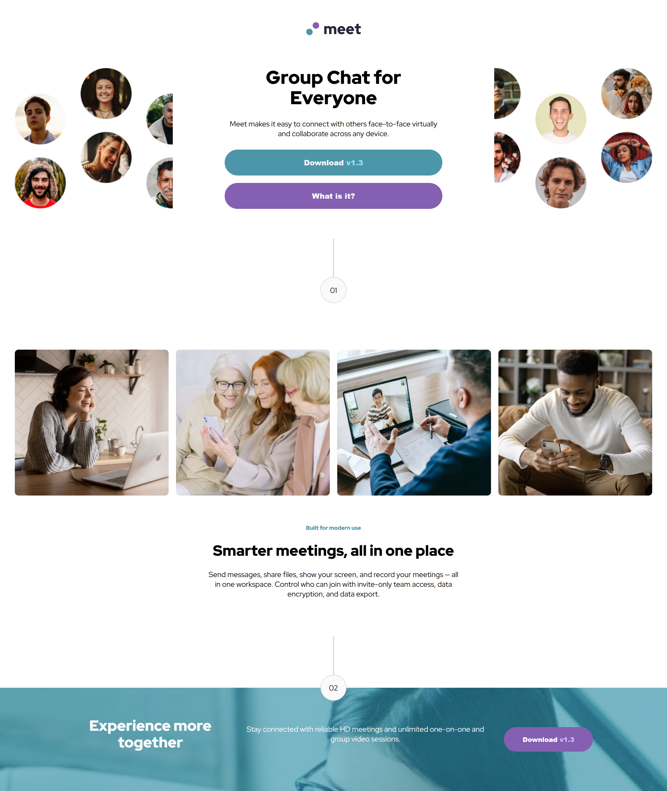
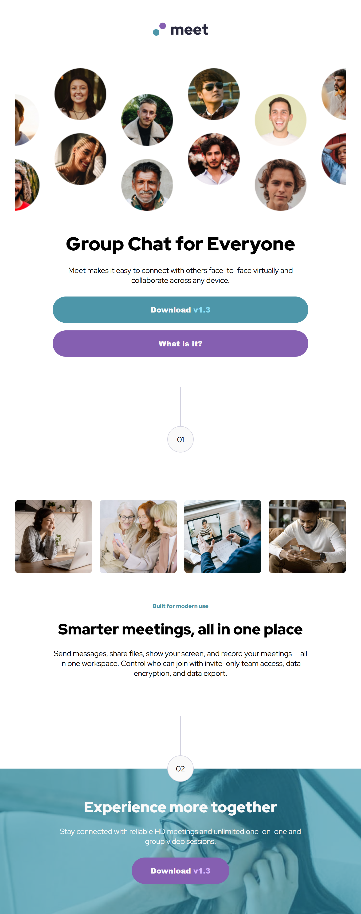
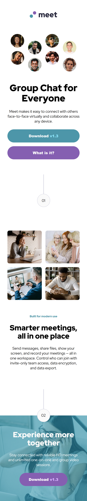

# Frontend Mentor - Meet landing page solution

This is a solution to the [Meet landing page challenge on Frontend Mentor](https://www.frontendmentor.io/challenges/meet-landing-page-rbTDS6OUR). Frontend Mentor challenges help you improve your coding skills by building realistic projects.

## Table of contents

- [Overview](#overview)
  - [The challenge](#the-challenge)
  - [Screenshot](#screenshot)
  - [Links](#links)
- [My process](#my-process)
  - [Built with](#built-with)
  - [What I learned](#what-i-learned)
  - [Continued development](#continued-development)
- [Author](#author)

## Overview

### The challenge

Users should be able to:

- View the optimal layout depending on their device's screen size
- See hover states for interactive elements

### Screenshot

### Links

- Solution URL: [https://github.com/iDevCloud/meet-landing-page-main]
- Live Site URL: [meet-landing-page-main.vercel.app]

## My process

### Built with

- Semantic HTML5 markup
- CSS custom properties
- Flexbox
- CSS Grid
- Mobile-first workflow

### What I learned

I came back on classic CSS to challenge me a bit. And that was the case. The hard things were the banner for the differents devices. And I discover the background-blend-mode property to done the footer.

I think it's easier to start in desktop-first developement for this project. But I did the mobile-first developement (I'm crazy).

I tried to do this project fast to move on the javascript language programming section in Frontend Mentor Website.

I will refactorize the code in the future, I don't want to spend to much time on it, I want to keep moving forward.

### Continued development

I'll use more pseudo-elements like ::before and ::after. I'll practice more project with position property. And try to size most of my content with width and height. These concepts need to be practice to be perfect.

## Author

- Frontend Mentor - [@iDevCloud](https://www.frontendmentor.io/profile/iDevCloud)
- X - [@idev_cloud](https://x.com/idev_cloud)
